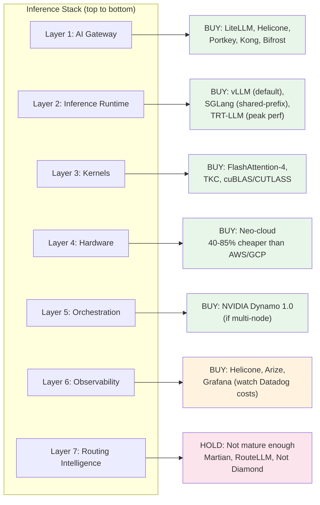

# Build vs Buy Per Layer

The inference stack has 7 layers. Each is an independent build-vs-buy decision.

## Layer Verdicts

| Layer | Verdict | Build When | Buy Options |
|-------|---------|-----------|-------------|
| 1. AI Gateway | **Buy** | Almost never | LiteLLM, Helicone (~50ms, Apache 2.0), Portkey (enterprise), Kong, Bifrost (11μs) |
| 2. Inference Runtime | **Buy** | Character.AI-level scale | vLLM (default), SGLang (shared-prefix), TRT-LLM (peak perf), ~~TGI~~ (maintenance mode) |
| 3. Kernels | **Buy** | Never (outside foundation labs) | FlashAttention-4, TKC, cuBLAS/CUTLASS |
| 4. Hardware | **Buy** | Hyperscaler-level | Neo-cloud: CoreWeave, Nebius, Lambda, RunPod (40-85% cheaper) |
| 5. Orchestration | **Buy Dynamo** | Single-node (just use vLLM) | NVIDIA Dynamo 1.0 — 17+ production adopters |
| 6. Observability | **Buy** | Never | Helicone, Arize, Grafana. Datadog works but watch for 40-200% bill increase |
| 7. Routing Intelligence | **Hold** | Not yet | Martian, RouteLLM, Not Diamond — category immature |

## The Vanity Infrastructure Test

If the only reason to self-host is "we want control," and the team doesn't have
a named owner who will maintain the stack through model updates, quantization
changes, and runtime upgrades — it's vanity infrastructure. It will rot.

## The Observability Warning

LLM observability costs are growing 30-50% YoY. AI workloads generate 10-50x
more telemetry than traditional services. The median Datadog bill for mid-market
companies is $123K/year and growing.

Budget 2-4x your Year-1 observability estimate. If your observability bill
exceeds 5% of your inference compute bill, you have a configuration problem.
