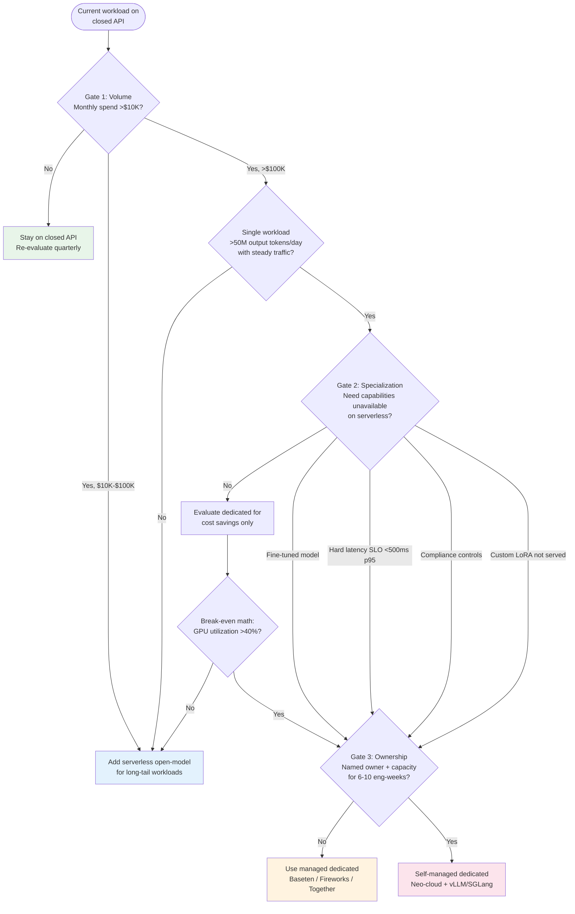

# When to Leave the API

The Migration Gate Framework: three gates, all must pass.

## Gate Details

### Gate 1: Volume
- Under ~$10K/month: Stay on closed APIs
- $10K-$100K/month: Add serverless open-model (Together, Fireworks, DeepInfra)
- One workload >50M output tokens/day steady: Consider dedicated (realistically ~140-200M at production utilization)

### Gate 2: Specialization
- Fine-tuned models not available serverless
- Hard latency SLO (<500ms p95) — shared APIs spike to 2-4s p99 under load
- Compliance: data residency, zero retention, CMEK
- Custom quantization with controlled calibration

### Gate 3: Ownership
- 6-10 engineer-weeks for initial migration
- 4-8 weeks for optimization to cost crossover
- 2-4 weeks per model-update cycle ongoing
- If no owner exists, use managed dedicated (Baseten, Fireworks, Together)
