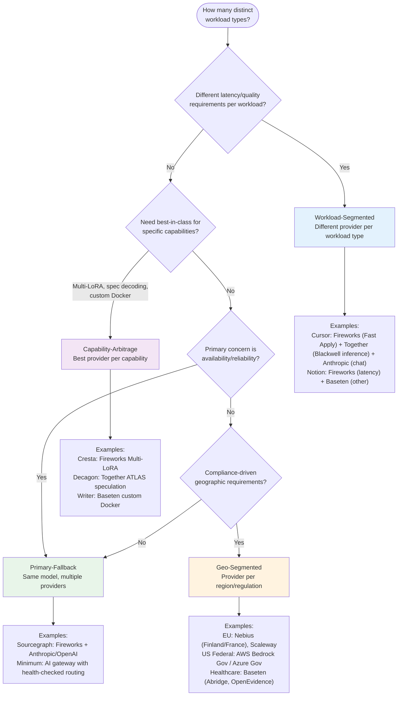

# Which Multi-Source Pattern?

Four inference sourcing patterns, each suited to different organizational needs.

## Pattern Details

### 1. Workload-Segmented
Different providers for different workload types based on latency/quality/cost tradeoffs.
- **When**: Multiple workloads with different SLOs
- **Complexity**: Medium (N provider relationships, simple routing)
- **Example**: Cursor — Fast Apply on Fireworks, Blackwell inference on Together, chat on Anthropic

### 2. Capability-Arbitrage
Best provider per specific technical capability.
- **When**: Need Multi-LoRA, speculative decoding, custom runtime, or RL inference
- **Complexity**: Medium-High (capability-specific integration per provider)
- **Example**: Cresta — thousands of LoRA adapters on Fireworks at 100x cost reduction vs GPT-4

### 3. Primary-Fallback
Same model family across multiple providers for availability.
- **When**: Single-provider outage would cost >1% monthly revenue
- **Complexity**: Low (AI gateway handles routing)
- **Minimum viable**: LiteLLM / Helicone / Portkey with health-checked failover

### 4. Geo-Segmented
Provider selection driven by compliance and data residency.
- **When**: EU data residency, US Federal, healthcare, China
- **Complexity**: High (separate contracts, monitoring, incident response per region)
- **Forced**: FedRAMP → hyperscaler only. EU PII → Nebius/Scaleway
