# Provider Fit Decision Tree

Which provider fits your workload? Start with your primary constraint.

```mermaid
flowchart TD
    START([What's your<br/>primary constraint?]) --> C

    C{Primary constraint?}

    C -->|Compliance / regulation| COMP
    C -->|Latency| LAT
    C -->|Cost| COST
    C -->|Model flexibility| FLEX
    C -->|Operational simplicity| OPS

    COMP{Regulation type?}
    COMP -->|US Federal / FedRAMP| FED[AWS Bedrock Gov<br/>or Azure Gov<br/>Only viable options]
    COMP -->|EU data residency| EU[Nebius Finland/France<br/>Scaleway, Mistral]
    COMP -->|Healthcare / HIPAA| HEALTH[Baseten zero-retention default<br/>Together, Fireworks with BAA]
    COMP -->|Finance + audit| FIN[Baseten Writer reference<br/>or hyperscaler]

    LAT{Latency requirement?}
    LAT -->|Raw decode speed| GROQ[Groq / Cerebras<br/>Custom silicon]
    LAT -->|p95 TTFT <200ms| FW_LAT[Fireworks<br/>FireAttention + speculation]
    LAT -->|Agentic multi-hop <500ms| SPEC[Together ATLAS<br/>or Fireworks FireOptimizer]

    COST{Budget level?}
    COST -->|Minimize per-token| DI[DeepInfra<br/>10-30% below Fireworks/Together]
    COST -->|Minimize LCPR| CALC[Run the LCPR calculator<br/>with your actual workload]
    COST -->|Need Multi-LoRA| FW_LORA[Fireworks Multi-LoRA<br/>$0.20/M for 8B base]

    FLEX{What flexibility?}
    FLEX -->|Broad model catalog| TOG[Together AI<br/>Widest serverless catalog]
    FLEX -->|Custom Docker / TRT-LLM| BAS[Baseten Truss<br/>Full runtime control]
    FLEX -->|Fine-tune + serve| TOG_FT[Together or Fireworks<br/>Customer owns weights]

    OPS{Team size?}
    OPS -->|No ML infra team| MANAGED[Managed: Together, Fireworks,<br/>or Baseten dedicated]
    OPS -->|Have infra engineers| SELF[Neo-cloud + vLLM/SGLang<br/>Lambda, CoreWeave, RunPod]

    style FED fill:#e8eaf6,color:#333
    style EU fill:#e8eaf6,color:#333
    style HEALTH fill:#e8f5e9,color:#333
    style FIN fill:#e8f5e9,color:#333
    style GROQ fill:#fff3e0,color:#333
    style FW_LAT fill:#fff3e0,color:#333
    style SPEC fill:#fff3e0,color:#333
    style DI fill:#e3f2fd,color:#333
    style CALC fill:#e3f2fd,color:#333
    style FW_LORA fill:#e3f2fd,color:#333
    style TOG fill:#f3e5f5,color:#333
    style BAS fill:#f3e5f5,color:#333
    style TOG_FT fill:#f3e5f5,color:#333
    style MANAGED fill:#fce4ec,color:#333
    style SELF fill:#fce4ec,color:#333
```

## Where Each Provider Wins

| Provider | Wins When | Loses When |
|----------|-----------|-----------|
| **Together AI** | Broad catalog, ATLAS speculation, fine-tune + serve on one platform | Raw serverless latency on curated models |
| **Fireworks AI** | Latency-critical, Multi-LoRA, RL post-training, agentic coding | Model catalog breadth, data retained by default on Response API |
| **Baseten** | Custom Docker, zero-retention default, healthcare, observability | Per-replica pricing higher than neo-cloud bare metal |
| **Hyperscalers** | FedRAMP, enterprise compliance, existing agreements | Cost (40-85% premium), optimization lag |
| **Groq/Cerebras** | Raw decode speed | Model coverage, vendor lock-in |
| **DeepInfra** | Lowest per-token serverless price | Smaller feature set, less enterprise support |
| **Neo-clouds** | Self-managed dedicated at 40-85% savings | Requires ML infra team |
